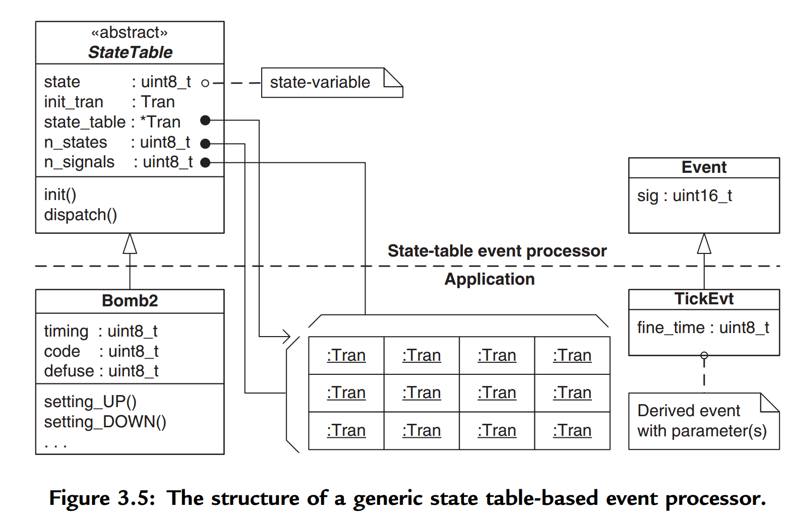
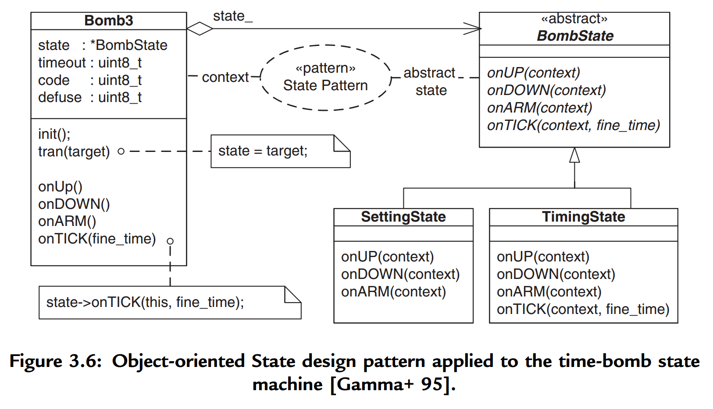
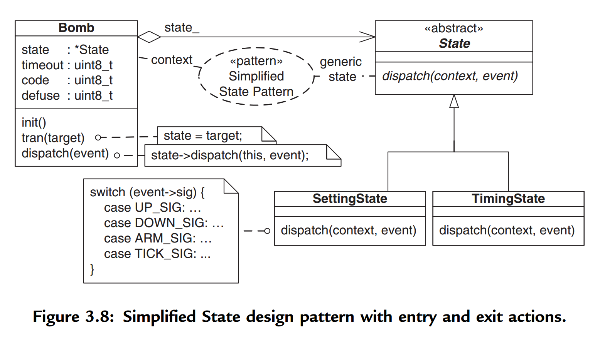
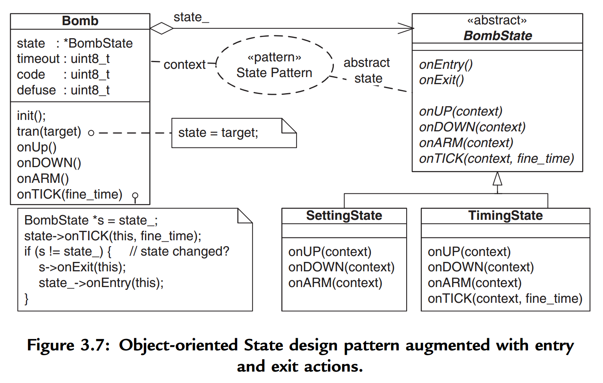
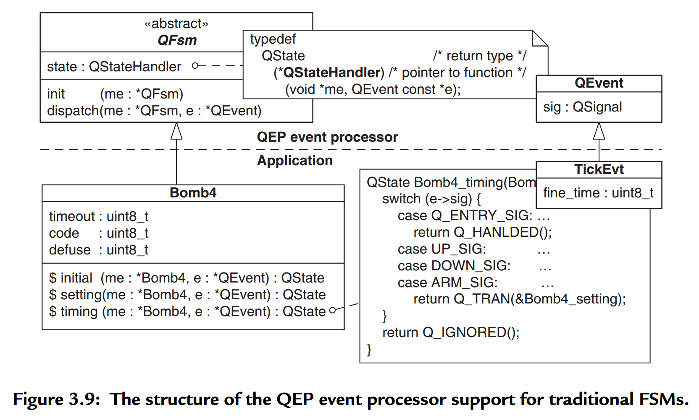
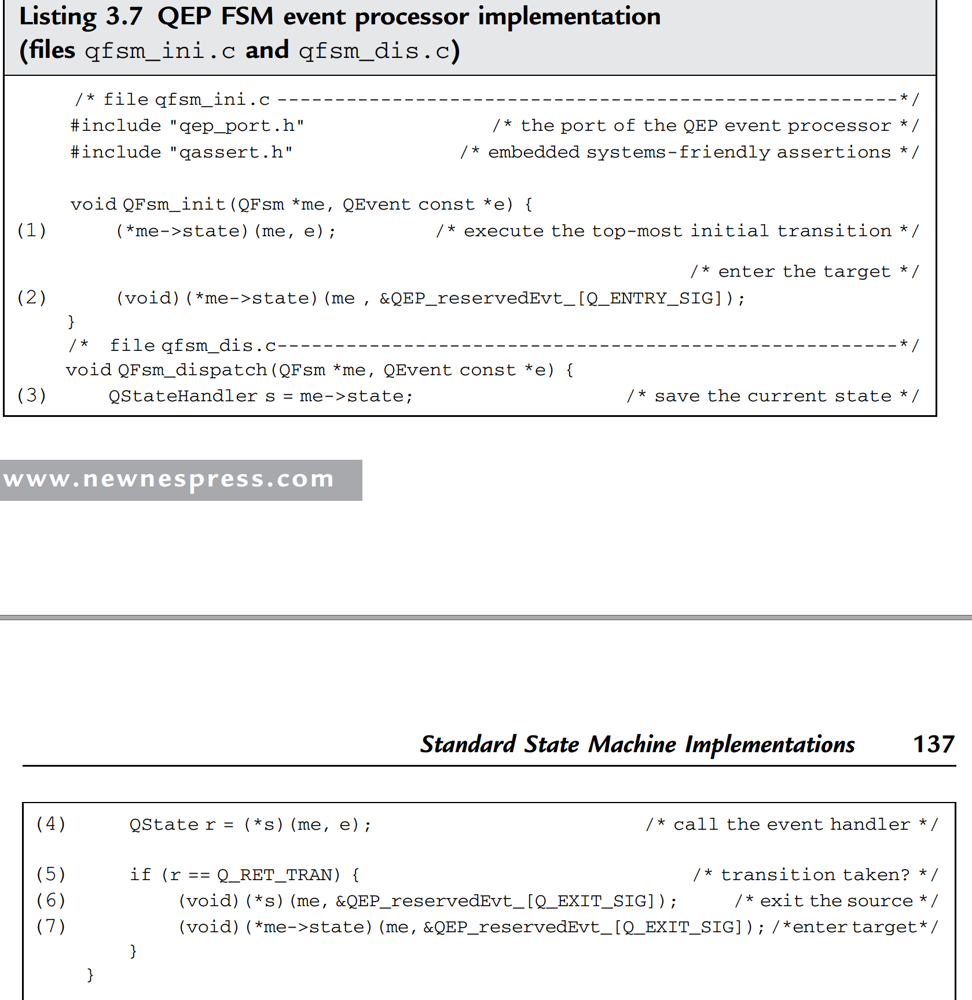
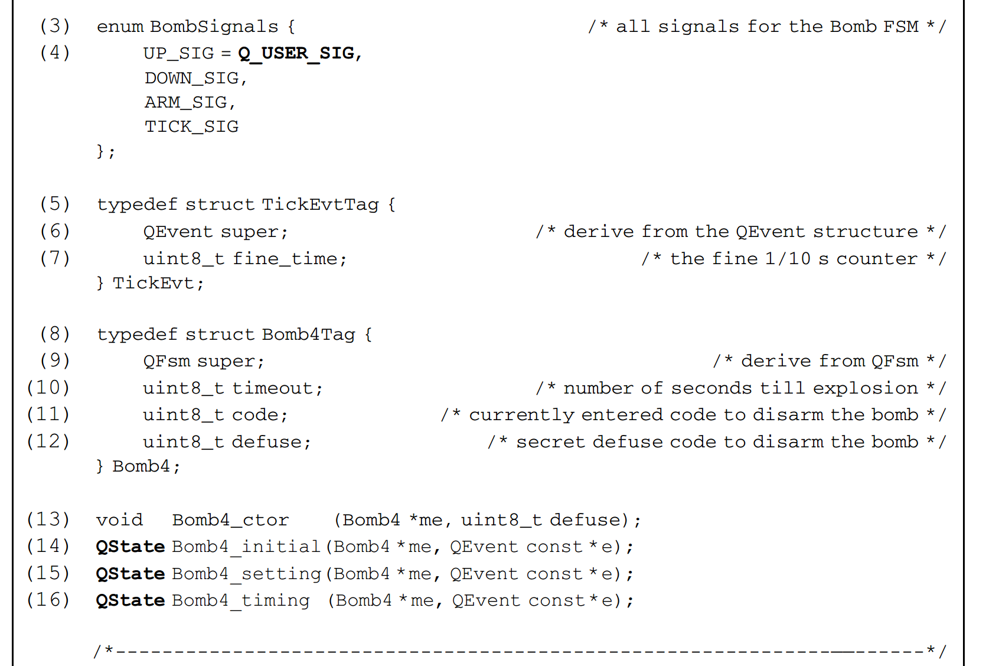
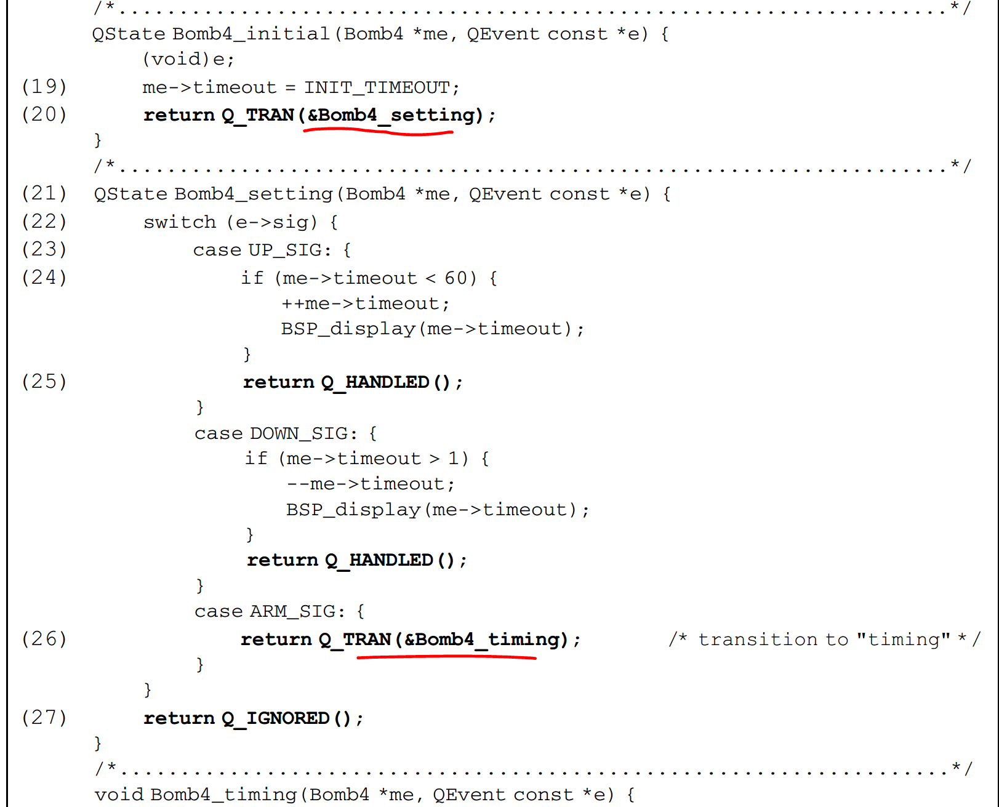

User Interface with Statecharts [in ClojureScript]

## State Machine Implementation

### Chapter 3

Typical implementations of state machines in high-level programming languages, such
as C or C++, include:
- The nested switch statement
- The state table
- The object-oriented State design pattern
- Other techniques that are often a combination of the above

However, it is far better to separate the state machine code from a particular concurrency model and to provide a flexible and uniform way of passing events with arbitrary parameters. Therefore, implementations in this chapter use a simple and generally applicable interface to a state machine.
The interface I propose consists of just two functions: `init()`, to trigger the top-level initial transition in a state machine, and `dispatch()`, to dispatch an event to the state machine. In this simple model, a state machine is externally driven by invoking `init()` once and `dispatch()` repetitively, for each event.

#### Representing Events

As described in Chapter 2, events consist really of two parts: the `signal` of the event conveys the type of the occurrence (such as arrival of the time tick), and `event parameters` convey the quantitative information about the occurrence (such as the fractional part of a second in the time tick event). 
In event-driven systems, event instances are frequently passed around, placed in event queues, and eventually consumed by state machines. Consequently, it is very convenient to represent events as `event objects` that combine the signal and the event parameters into one entity.
```c
typedef struct EventTag {
uint16_t sig; /* signal of the event */
/* add event parameters by derivation from the Event structure... */
} Event;
typedef struct TickEvtTag {
Event super; /* derive from the Event structure */
uint8_t fine_time; /* the fine 1/10 s counter */
} TickEvt;
```

With this representation of events, the signature of the dispatch() function looks as follows:
```c
void dispatch(StateMachine *me, Event const *e);
```
The first argument `StateMachine *me` is the pointer to the state machine object. Different state machine implementation techniques will define the `StateMachine` structure differently. 
The second argument `Event const *e` is the pointer to the event object, which might point to a structure derived from `Event` and thus might contain arbitrary event parameters.

#### Nested Switch Statement

Perhaps the most popular and straightforward technique of implementing state machines is the nested `switch` statement, with a scalar state variable used as the discriminator in the first level of the `switch` and the signal of the event used in the second level.

File `bomb1.c`
```c
enum BombSignals { /* all signals for the Bomb FSM */
UP_SIG,
DOWN_SIG,
ARM_SIG,
TICK_SIG
};
/*....................................................................*/
enum BombStates { /* all states for the Bomb FSM */
SETTING_STATE,
TIMING_STATE
};
/*.....................................................................*/
typedef struct EventTag {
uint16_t sig; /* signal of the event */
/* add event parameters by derivation from the Event structure... */
} Event;
typedef struct TickEvtTag {
Event super; /* derive from the Event structure */
uint8_t fine_time; /* the fine 1/10 s counter */
} TickEvt;
/*.....................................................................*/
typedef struct Bomb1Tag { /* the Bomb FSM */
uint8_t state; /* the scalar state-variable */
uint8_t timeout; /* number of seconds till explosion */
uint8_t code; /* currently entered code to disarm the bomb */
uint8_t defuse; /* secret defuse code to disarm the bomb */
} Bomb1;
/* macro for taking a state transition */
#define TRAN(target_) (me->state = (uint8_t)(target_))
/*.....................................................................*/
void Bomb1_init(Bomb1 *me) { /* initial transition */
me->timeout = INIT_TIMEOUT;/* timeout is initialized in initial tran. */
TRAN(SETTING_STATE);
}
/*.....................................................................*/
void Bomb1_dispatch(Bomb1 *me, Event const *e) { /* dispatching */
switch (me->state) {
 case SETTING_STATE: {
  switch (e->sig) {
   case UP_SIG: { /* internal transition with a guard */
    if (me->timeout < 60) { /* guard condition */
      ++me->timeout; /* actions associated with the transition coded directly */
      BSP_display(me->timeout); /* actions associated with the transition coded directly */
    }
    break;
   }
   case DOWN_SIG: { /* internal transition with a guard */
    if (me->timeout > 1) {
      --me->timeout;
      BSP_display(me->timeout);
    }
    break;
   }
   }
   case ARM_SIG: { /* regular transition */
     me->code = 0; /* transition action */
     TRAN(TIMING_STATE); /* transition to "timing" */
    break;
   }
  } 
 }
}
```

Consequences

- It is simple.
- It requires enumerating both signals and states.
- It does not promote code reuse because all elements of a state machine must be coded specifically for the problem at hand.
- The whole state machine is coded as one monolithic function, which easily can grow too large.
- Event dispatching time is not constant but depends on the performance of the two levels of switch statements, which degrade with increasing number of cases (typically as O(log n), where n is the number of cases).
- The implementation is not hierarchical. You could manually code entry/exit actions directly in every transition, but this would be prone to error and difficult to maintain in view of changes in the state machine topology. This is mainly because the code pertaining to one state (e.g., an entry action) would become distributed and repeated in many places (on every transition leading to this state).

The variations of this method include eliminating the second level of the switch, if the state machine handles only one type of event. For example, parser state machines often receive identical characters from the input stream. In addition, signal-processing state machines often receive identical time samples of the signal under control.

#### State Table

The most popular is the two-dimensional state table that lists events along the horizontal dimension and states along the vertical dimension.
The contents of the cells are transitions represented as `{action, next-state}` pairs.

                 | Events ->
-----------------| UP          | DOWN | ...
       | setting | setting_up, | ...  |
states |         | setting     | ...  |
|      |-------------------------------
v      | timing  | timing_up,  | ...  |
       |         | timing      | ...  |  
       


File `statetbl.h`
```c
typedef struct EventTag {
uint16_t sig; /* signal of the event */
/* add event parameters by derivation from the Event structure */
} Event;

struct StateTableTag; /* forward declaration */

typedef void (*Tran)(struct StateTableTag *me, Event const *e);

typedef struct StateTableTag {
  Tran const *state_table; /* the State-Table */
  uint8_t n_states; /* number of states */
  uint8_t n_signals; /* number of signals */
  uint8_t state; /* the current active state */
  Tran initial; /* the initial transition */
} StateTable;

void StateTable_ctor(StateTable *me, Tran const *table, uint8_t n_states, int8_t n_signals,Tran initial);
void StateTable_init(StateTable *me); /* init method */
void StateTable_dispatch(StateTable *me, Event const *e); /* dispatch method */
void StateTable_empty(StateTable *me, Event const *e); /* empty action */

/* macro for taking a state transition inside a transition function */
#define TRAN(target_) (((StateTable *)me)->state = (uint8_t)(target_))
```

File `statetbl.c`
```c
void StateTable_ctor(StateTable *me,Tran const *table, uint8_t n_states, uint8_t n_signals,Tran initial)
{
  me->state_table = table;
  me->n_states = n_states;
  me->n_signals = n_signals;
  me->initial = initial;
  me->state = n_states; /* initialize state out of range */
}
/*......................................................................*/
void StateTable_init(StateTable *me) {
 (*me->initial)(me, (Event *)0); /* top-most initial transition */
 assert(me->state < me->n_states); /* the initial tran. must change state */
}
/*......................................................................*/
void StateTable_dispatch(StateTable *me, Event const *e) {
Tran t;
 assert(e->sig < me->n_signals); /* require the signal in range */
 t = me->state_table[me->state*me->n_signals + e->sig];
 (*t)(me, e); /* execute the transition function */
 assert(me->state < me->n_states); /* ensure that state stays in range */
}
```

File `bomb2.c`
```c
enum BombSignals { /* all signals for the Bomb FSM */
UP_SIG,
DOWN_SIG,
ARM_SIG,
TICK_SIG
};
/*....................................................................*/
enum BombStates { /* all states for the Bomb FSM */
SETTING_STATE,
TIMING_STATE
};
/*.....................................................................*/
typedef struct EventTag {
uint16_t sig; /* signal of the event */
/* add event parameters by derivation from the Event structure... */
} Event;
typedef struct TickEvtTag {
Event super; /* derive from the Event structure */
uint8_t fine_time; /* the fine 1/10 s counter */
} TickEvt;
/*.....................................................................*/
typedef struct Bomb2Tag { /* the Bomb FSM */
 StateTable super; /* derive from the StateTable structure */
 uint8_t timeout; /* number of seconds till explosion */
 uint8_t defuse; /* secret defuse code to disarm the bomb */
 uint8_t code; /* currently entered code to disarm the bomb */
} Bomb2;
/*---------------------------------------------------------------------*/
void Bomb2_ctor(Bomb2 *me, uint8_t defuse); /* the "constructor" */
void Bomb2_initial (Bomb2 *me); /* the initial transition function */
void Bomb2_setting_UP (Bomb2 *me, Event const*e); /* transition function */
void Bomb2_setting_DOWN(Bomb2 *me, Event const*e);/* transition function */
void Bomb2_setting_ARM (Bomb2 *me, Event const *e); /* transition function */
void Bomb2_timing_UP (Bomb2 *me, Event const *e); /* transition function */
void Bomb2_timing_DOWN (Bomb2 *me, Event const *e); /* transition function */
void Bomb2_timing_ARM (Bomb2 *me, Event const *e); /* transition function */
void Bomb2_timing_TICK (Bomb2 *me, Event const *e); /* transition function */
/*---------------------------------------------------------------------*/
void Bomb2_ctor(Bomb2 *me, uint8_t defuse) {
/* state table for Bomb state machine */
 static const Tran bomb2_state_table[MAX_STATE][MAX_SIG] = {
  { (Tran)&Bomb2_setting_UP, (Tran) &Bomb2_setting_DOWN,
   (Tran)&Bomb2_setting_ARM, &StateTable_empty },
  { (Tran)&Bomb2_timing_UP, (Tran) &Bomb2_timing_DOWN,
    (Tran)&Bomb2_timing_ARM, (Tran) &Bomb2_timing_TICK }
 };
 StateTable_ctor(&me->super,&bomb2_state_table[0][0], MAX_STATE, MAX_SIG,(Tran)&Bomb2_initial); /* construct the superclass */
 me->defuse = defuse; /* set the secret defuse code */
}
/*.................................................................*/
void Bomb2_timing_UP(Bomb2 *me, Event const *e) {
(void)e; /* avoid compiler warning about unused parameter */
me->code <<= 1;
me->code j= 1;
}
/*.................................................................*/
void Bomb2_timing_DOWN(Bomb2 *me, Event const *e) {
(void)e; /* avoid compiler warning about unused parameter */
me->code <<= 1;
}
/*.................................................................*/
void Bomb2_timing_ARM(Bomb2 *me, Event const *e) {
(void)e; /* avoid compiler warning about unused parameter */
if (me->code == me->defuse) {
TRAN(SETTING_STATE); /* transition to "setting" */
}
}
```

Consequences

1. It maps directly to the highly regular state table representation of a state machine.
2. It requires the enumeration of states and signals that are used as indexes into the state table.
3. Because states and signals are used as indexes into an array, they must both be contiguous and start with zero.
4. It provides relatively good and deterministic performance for event dispatching (O(const), not taking into account action execution).
5. It promotes code reuse of the generic event processor, which is typically small.
6. It requires a large state table, which is typically sparse. However, because the state table is constant, it often can be stored in ROM rather than RAM.
7. It requires a complicated initialization of the state table that must implicitly match the enumerated states and signals. Manual maintenance of this initialization, in view of changes in the state machine topology, is tedious and prone to error. For instance, adding a new state requires adding and initializing a whole row in the state table It requires a large number of fine-granularity functions representing actions.
9. It typically relies heavily on pointers to functions when implemented in C/C++ (see Section 3.7.1) because state tables typically contain large numbers of such pointers to functions.
10. It is not hierarchical. Although the state table can be extended to implement state nesting, entry/exit actions, and transition guards, these extensions require hardcoding whole transition chains into transition action functions, which is prone to error and inflexible.

There seem to be two main variations on state table implementation in C/C++. Concrete state machines can either derive from the generic state table event processor (inheritance) or contain a state table processor (aggregation).

The main shortcoming of the two-dimensional state-table representation is the difficulty of showing guard conditions and transitions leading to different states based on different guards. Therefore, some authors use a one-dimensional state transition table.

Current State|Event(Parameters)|[Guard]           |Next State|Actions
setting      | UP              |[me->timeout < 60]|setting   |++me->timeout;BSP_display(me->timeout)
...

In the direct implementation of the one-dimensional state table, the transitions are more complex objects that contain:
- Pointer to the guard function
- Next state
- A list of pointers to action functions

#### Object-Oriented State Design Pattern



The key idea in this pattern is to introduce an abstract class `BombState` to represent the states of the time bomb. The BombState declares an interface common to all states, where each operation corresponds to an event. 
Subclasses of BombState, such as `SettingState` and `TimingState`, implement state-specific behavior by overriding the operations inherited from BombState. 
For example, SettingState handles the UP event in its own specific way by defining the SettingState::onUP() operation.
Adding new events requires adding new operations to the abstract BombState class, and adding new states requires adding new subclasses of BombState.

The context class Bomb3 maintains the state as a pointer to a subclass of BombState (see the state data member). Bomb3 also contains all the extended state variables that the time bomb uses, such as timeout, code, and defuse. 
The class Bomb3 provides an interface identical to the BombState, that is, each handled event corresponds to an operation. The event-handler operations in Bomb3 delegate all state-specific requests to the current state object via the state pointer. In this technique change of state corresponds to changing the current state object, which is accomplished in the context class operation tran().

Consequences

- It relies heavily on polymorphism and requires an object-oriented language like C++.
- It partitions state-specific behavior and localizes it in separate classes.
- It makes state transitions efficient (reassigning one pointer).
- It provides very good performance for event dispatching through the late binding mechanism (O(const), not taking into account action execution). This performance is generally better than indexing into a state table plus invoking a method via a function pointer, as used in the state table technique. However, such performance is only possible because the selection of the appropriate event handler is not taken into account. Indeed, clients typically will use a switch statement to perform such selections. (See the main() function in bomb3.cpp.)
- It allows you to customize the signature of each event handler. Event parameters are explicit, and the typing system of the language verifies the appropriate type of all parameters at compile time (e.g., onTICK() takes a parameter of type uint8_t).
- The implementation is memory efficient. If the concrete state objects don’t have attributes (only operations), they can be shared (as in the Bomb3 example).
- It does not require enumerating states.
- It does not require enumerating events.
- It compromises the encapsulation of the context class, which typically requires granting friendship to all state classes.
- It enforces indirect access to the context’s parameters from the methods of the concrete state subclasses (via the context pointer)
- Adding states requires subclassing the abstract state class.
- Handling new events requires adding event handlers to the abstract state classinterface.
- The event handlers are typically of fine granularity, as in the state table approach.
- The pattern is not hierarchical.

The State pattern can be augmented to support entry and exit actions to states.

The standard State design pattern can also be simplified to provide the standard state machine interface consisting of operations `init()` and `dispatch()`.
A generic dispatch() operation of the abstract state class handles all events in a state and thus becomes a generic `state-handler` operation. The abstract state class then also becomes generic since it no longer depends on specific event signatures. 
Additionally, each state handler must perform explicit demultiplexing of events (based on the signal), which typically involves one level of switch statement, as shown in the note to the SettingState::dispatch() operation.




#### QEP FSM Implementation

The QEP support for the basic FSMs combines elements from the nested switch statement, state table, and the simplified State design pattern, but it also adds some original ideas. The design is based on a generic event processor (the QEP), similar in functionality to the state-table event processor.

The novelty of the QEP design comes from mapping states directly to state-handler functions that handle all events in the state they represent.

The central element of the QEP event processor is the QFsm structure that keeps track of the current state by means of a pointer to a state-handler function. The QFsm structure also provides the standard state machine interface functions init() and dispatch().
The QFsm structure is abstract, meaning that it is not intended for direct instantiation but rather only for derivation of concrete state machine structures, such as Bomb4.
The derived state machine structure adds its own extended state variables such as timeout, code, and defuse, as well as all state-handler functions.



State machine implementation


Application implementation



Consequences

- It partitions state-specific behavior and localizes it in separate state-handler functions. These functions have just about the right granularity—neither too fine (as the action functions in the state table or event operations in the State pattern) nor monolithic (as in the nested switch statement technique).
- It provides direct and efficient access to extended state variables from statehandler functions (via the “me” pointer) and does not require compromising the encapsulation of the state machine structure.
- It provides good performance for event dispatching by eliminating one level of switch from the nested switch statement technique and replacing it with a very efficient pointer to function dereferencing. In typical implementations, state handlers still need one level of a switch statement to discriminate events based on the signal, which has performance dependent on the number of cases (typically O(log n), where n is the number of cases). The switch statement can be replaced by a one-dimensional lookup table in selected (time-critical) state handlers.
- It is scalable, flexible, maintainable, and traceable. It is easy to add both states and events, as well as to change state machine topology, even late in the development cycle, because every state machine element is represented in the code exactly once.
- It requires enumerating events.
- It does not require enumerating states.
- It is not hierarchical, but can be extended to include state hierarchy without sacrificing its good characteristics.

In the literature, you often find techniques that apply pointers to functions in a very similar way as the QP FSM implementation but still use a scalar state variable to resolve the state handler through a lookup table. This approach has several weaknesses:
It requires enumerating states, which are used as indexes into the call table.
- It requires allocating and initializing the call table.
- The indirection level of the call table degrades performance because of additional steps required by table lookup on top of dereferencing a pointer to function.

### General Discussion of State Machine Implementations

Except for the nested switch statement, all other state machine implementation techniques in C/C++ rely heavily on pointers to functions.
The point to remember from this discussion is that pointers to functions are the fastest mechanism for implementing state machines in C/C++. State machines are the “killer applications” for pointers to functions.

State machines offer a better, language-independent way of handling exceptions. A state machine associated with an event-driven subsystem can represent all conditions of the subsystem, including fault conditions. Instead of throwing an exception, an action should generate an `exception event`, which then triggers a statebased exception handling.

If you know how to code a flowchart, you already know how to implement guards and choice pseudostates. Flowcharts map easily to plain structured code and are therefore straightforward to implement in those techniques that give you explicit choice of the target of a state transition, such as the nested switch statement, the State design pattern, and the QP FSM implementation. 
Conditional execution is harder to use in the traditional state-table representation because the rigidly structured state table explicitly specifies the targets of state transitions. The solution presented in Section 3.4.1 solves this problem by removing the “next-state” from the table and pushing the responsibility for changing states into the action functions.

One way of implementing entry and exit actions is to dispatch reserved signals (e.g., Q_ENTRY_SIG and Q_EXIT_SIG) to the state machine. As shown in Listing 3.7, upon detecting a state transition, the state machine dispatch() operation sends the Q_EXIT_SIG signal to the source state and then sends the Q_ENTRY_SIG signal to the target state.

## References

- Constructing the User Interface with Statecharts https://www.amazon.com/Constructing-User-Interface-Statecharts-Horrocks/dp/0201342782
- Practical UML Statecharts in C/C++, 2nd Edition: Event-Driven Programming for Embedded Systems http://www.state-machine.com/psicc2/